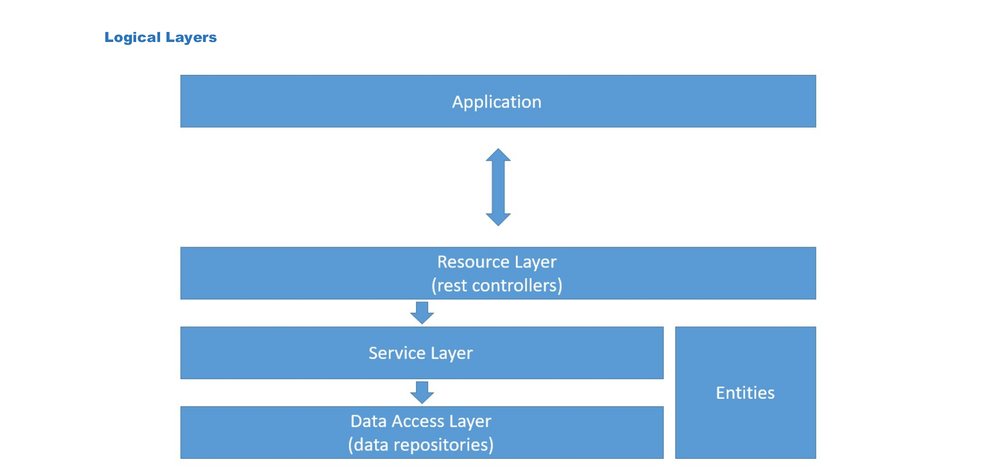
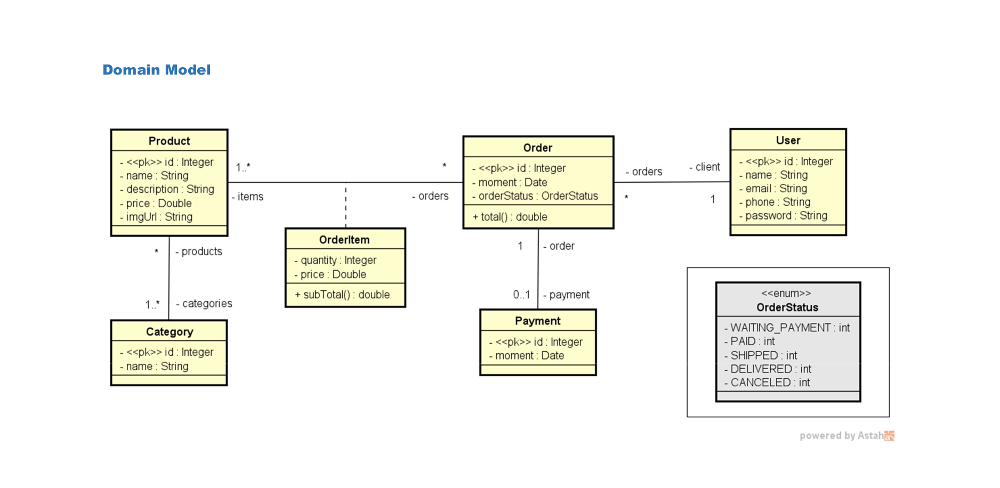
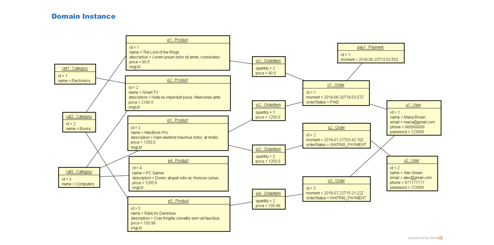
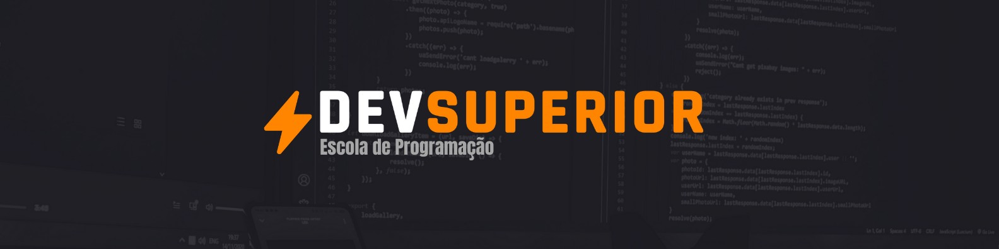

<h1 align="center">
    Sistema de Pedidos
</h1>

<p align="center">
  <a href="#-projeto">Projeto</a>&nbsp;&nbsp;&nbsp;|&nbsp;&nbsp;&nbsp;
  <a href="#-tecnologias">Tecnologias</a>&nbsp;&nbsp;&nbsp;|&nbsp;&nbsp;&nbsp;
  <a href="#-executar aplicação">Executar Aplicação</a>&nbsp;&nbsp;&nbsp;|&nbsp;&nbsp;&nbsp;
  <a href="#-licença">Licença</a>
</p>

<p align="center">
 

  
</p>
<br>

## 💻 Projeto

Este projeto consiste na API de um sistema para realizar pedidos. 💜
<br>
Foi implementado o modelo de dominío e suas instâncias de dominío conforme mostra as imagens abaixo, seguindo a estrutura padrão de camadas lógicas: resource, service e repository. 💜
<br>

## Camadas Lógicas

<p align="center">
    
</p>

<br>

## Modelo de domínio

<p align="center">
    
</p>

<br>

## Instância de domínio

<p align="center">
    
</p>

<br>

## 🚀 Tecnologias

Esse projeto foi desenvolvido com as seguintes tecnologias:


<br>

## Executar Aplicação

### 🔥 Executando Localmente a Aplicação

Caso você deseja executar o projeto na sua máquina local, você precisará instalar o Java 17, Maven, Banco de Dados PostgreSQL e uma IDE, sugiro o IntelliJ IDEA Community Edition. Após a instalação, basta seguir os passos abaixo:

### 🌀 Começando...

Para começar, você deve simplesmente clonar o repositório do projeto na sua máquina e instalar as dependências contidas no pom.xml.

#### ❗️ Instalando as Dependências:

Abre o cmd (caso esteja utilizando o Windows), ou outro terminal de sua preferência, navegue até o local onde você clonou o projeto, exemplo:

```sh
"C:\Users\NomeDoComputador\Documents\clonedoprojeto"
```

Quando estiver na pasta do projeto `sistema-pedidos`, dentro dele conterá o projeto back-end na pasta **`api-sistema-pedidos`**, entre na pasta e digite no cmd ou outro terminal de sua preferência a seguinte instrução: **(dentro da pasta `api-sistema-pedidos` do projeto sistema-pedidos clonado)**

```sh
mvn clean install
```

Abra o projeto com o IntelliJ IDEA Community Edition, ou sua IDE de preferência e execute o spring boot app:

```sh
ApiSistemaPedidosAplication.java
```

Pronto! dessa forma o projeto estará rodando localmente em sua maquina, para acessar o backend:
<br>

```sh
http://localhost:8080
```

## 🚩 Tenho Dúvidas... O que fazer?

Caso tenham dúvidas sobre o código do projeto, sintam-se a vontade em abrir uma **[ISSUE AQUI](https://github.com/Wanderson-A-Timoteo/sistema-pedidos/issues)**. Assim que possível, estarei respondendo as todas as dúvidas que tiverem!
<br>

## Licença

Esse projeto está sob a licença MIT. Veja o arquivo [LICENSE](LICENSE.md) para mais detalhes.

## Autor:

Feito com ♥ by

<div align='center'>

[<br><sub>**Wanderson A. Timóteo**</sub>](https://wanderson-a-timoteo.github.io/my-portfolio-dark-light/)

</div>

<br>

## Agradecimentos:

<h1 align="center">
    
</h1>

Projeto desenvolvido durante as aulas do curso "Java completo 2023 - POO + Projetos" da plataforma de ensino [DevSuperior](https://devsuperior.com.br/).

Agradecimento ao instrutor [Nelio Alves](https://github.com/devsuperior) por preparar conteúdos relevantes e com qualidade de ensino.
